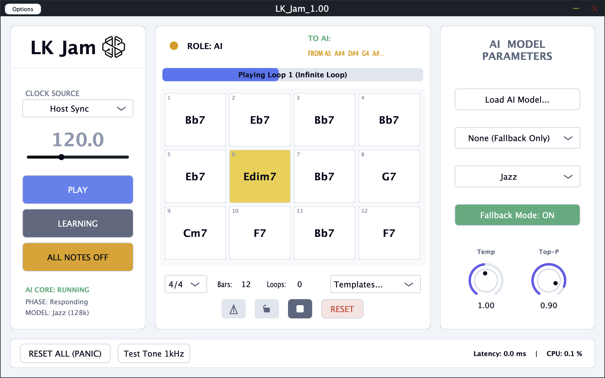

# LK_Jam | Real-Time Interactive AI Music DAW Plugin
A low-latency human-AI improvisation VST3/AU plugin built with **JUCE + RTNeural**, implementing jazz-style Trading Fours turn-based jam with role-aware GRU and Markov-chain fallback engine.
> The project is under continuous iteration. Markov algorithm is introduced for plugin debugging and verification, sourced from [ai-improviser-plugin](https://github.com/yeeking/ai-improviser-plugin). Thanks to the original author for open source contribution.


Demo Videos:


https://youtu.be/ipnVo04R7bA?si=tQyQG-xEdf1EshvH

## ✨ Key Features
- Ultra-low-latency neural inference powered by RTNeural: compile-time network instantiation, allocation-free & wait-free real-time audio-thread computation
- Jazz-inspired turn-taking interaction: configurable human/AI alternating bars with host BPM & timeline sync (Listen → Respond → Idle state machine)
- Dual AI backend
  - Lightweight Role-Aware GRU neural generator (harmony-conditioned melody generation)
  - Markov Chain engine as stable lightweight fallback (introduced for test & debug)
- Standard cross-platform audio plugin: compiled to VST3 / AU for Ableton, Logic, Cubase and all mainstream DAWs
- Professional DAW utilities: global reset, all-notes-off panic mute, built-in metronome, runtime CPU & latency profiling
- Full-featured GUI: real-time note visualization, chord progression display and AI parameter dashboard



## 📂 Project Structure
```
LK_Jam/
- CMakeLists.txt              # Build configuration (CMake)
- Source/
  - Core/                     # Core plugin runtime & audio/MIDI processing
    - PluginEditor.cpp        # GUI main logic
    - PluginEditor.h
    - PluginProcessor.cpp     # Audio/MIDI callback (real-time thread)
    - PluginProcessor.h
    - InferenceThread.cpp     # Background AI inference thread
    - InferenceThread.h
  - Data/                     # Data structures & shared type definitions
    - CircularBuffer.h        # Lock-free circular buffer for MIDI events
    - EventTypes.h            # Shared MIDI/event structs
    - HarmonyData.h           # Chord/progression data model
    - LockFreeQueue.h         # Lock-free queue for audio ↔ AI communication
  - Engine/                   # AI generation & interaction logic
    - IInferenceEngine.h      # Abstract inference engine interface
    - RTNeuralEngine.cpp      # RTNeural GRU inference implementation
    - RTNeuralEngine.h
    - StateMachine.h          # Interaction state machine (Listen/Respond/Idle)
    - SyncEngine.cpp          # Host transport/BPM/bar sync
    - SyncEngine.h
    - SessionDirector.cpp     # Orchestrates human-AI turn flow
    - SessionDirector.h
  - UI/                       # GUI components & panels
    - GlobalHostPanel.h       # Host sync/transport panel
    - SystemStatusPanel.h     # CPU/latency/state monitor
    - AIControlsPanel.h       # AI model/temp/topP controls
    - InteractiveDisplay.h    # Real-time note visualization
    - UI_GridCanvas.h         # GUI layout grid
    - UI_ChordDeck.h          # Chord progression display
    - UI_TransportBar.h       # Play/reset/metronome bar
  - Assets/
- README.md
```

## 🛠 Tech Stack
- Language: C++17
- Audio Framework: JUCE 7+
- Neural Inference: RTNeural
- AI Models: Custom GRU (Role-aware encoding), Markov Chain (from open-source repo for debugging)
- Core modules: Real-time MIDI capture, lock-free queue, host timeline sync, chord parsing

## 🎛 Plugin Parameters
- Temperature: Generation randomness [0.1 ~ 2.0]
- Top-P: Nucleus sampling threshold [0.1 ~ 1.0]
- Model Select: Disable / Markov Engine / GRU Neural(WIP)
- Style Preset: Jazz / Pop / Experimental
- Turn Bars: Length of single improvisation turn [1~16 bars]
- Cycle Bars: Total chord progression cycle length [2~32 bars]
- Fallback Mode: Auto chord-based generation when neural engine is disabled

## 🚀 Build Instructions
### Prerequisites
- C++17 compliant compiler
- CMake ≥3.20
- JUCE 7 or newer
- Integrated RTNeural source code

### Compile Steps
1. Clone repository locally
2. Configure CMake with valid JUCE path
3. Generate build project (Xcode / MSVC / Make)
4. Build target to output VST3/AU plugin binaries
5. Install plugin into your DAW plugin folder and load

## 🎯 Use Cases
- Live on-stage real-time human & AI jam performance
- Songwriting & melody idea generation for music production
- Interactive music practice & jazz ear training
- Research for low-latency embedded AI audio plugin development

## 📜 License
MIT License, free for academic research & non-commercial usage.
